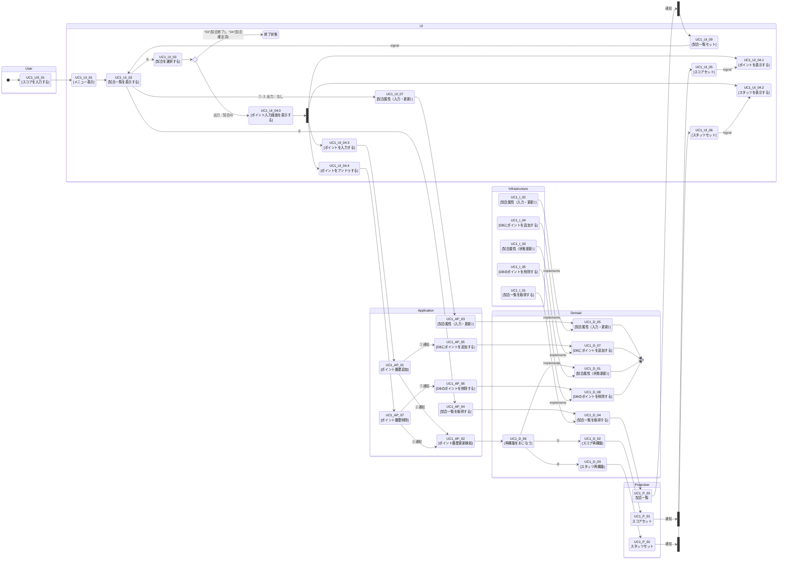

### １．アクティビティ図

- [01_ユースケース図.md](01_%E3%83%A6%E3%83%BC%E3%82%B9%E3%82%B1%E3%83%BC%E3%82%B9%E5%9B%B3.md) の UC1〜UC5 に対応する、業務フロー（ユーザー操作）とシステム処理をレーンで分けたアクティビティ図です。

- 矢印の意味
  - 制御フロー（Control Flow）：「この処理が完了したら、次の処理に進む」＝手順・順序・分岐・合流の流れ
  - オブジェクトフロー（Object Flow）：「データ（成果物）がこの処理から次の処理へ渡る」＝入力/出力データの受け渡し
- 四角の意味
  - 四角：処理（動詞で書く）「保存する」「更新する」「表示する」
  - ひし形：条件判断（疑問形）「不備あり？」「既存の試合？」
  - 丸/開始終了：開始・終了（UMLだと黒丸/二重丸。Mermaidでは ([開始]) などで代用）
  - もし「四角の文言」を統一したいなら、全部を「動詞＋目的語」（例：試合属性を更新する）に揃えると読みやすくなります。
- ID付番
  - UC1-U-xx：ユーザー操作（User lane）
  - UC1-S-xx：システム処理（System lane）
  - UC1-D-xx：分岐（Decision）
  - UC1-START/END：開始・終了（必要なら）
- 状態
  - 試合情報は状態（matchStatus）を持つ
  - "01"(試合開始前)、"02"(試合入力中)、"03"(試合終了)、"04"(試合確定済)

#### [UC1]試合結果を記録する

