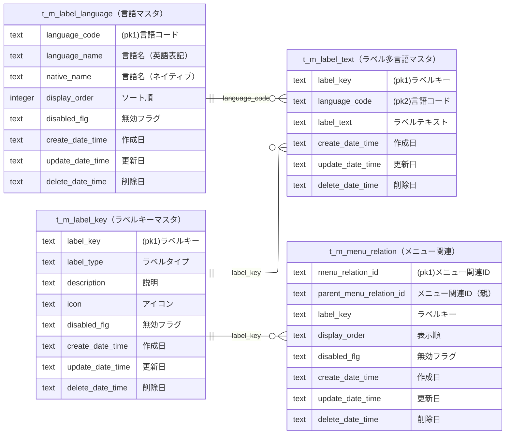

```mermaid
---
config:
  layout: elk
---
erDiagram
	direction LR
	t_m_label_language（言語マスタ） {
		text language_code  "(pk1)言語コード"
		text language_name  "言語名（英語表記）"  
		text native_name  "言語名（ネイティブ）"  
		integer display_order  "ソート順"  
		text disabled_flg  "無効フラグ"  
		text create_date_time  "作成日"
		text update_date_time  "更新日"
		text delete_date_time  "削除日"
	}

	t_m_label_key（ラベルキーマスタ） {
		text label_key  "(pk1)ラベルキー"
		text label_type  "ラベルタイプ"  
		text description  "説明"  
		text icon  "アイコン"
		text disabled_flg  "無効フラグ"  
		text create_date_time  "作成日"
		text update_date_time  "更新日"
		text delete_date_time  "削除日"
	}

	t_m_label_text（ラベル多言語マスタ） {
		text label_key  "(pk1)ラベルキー"
		text language_code  "(pk2)言語コード"  
		text label_text  "ラベルテキスト"  
		text create_date_time  "作成日"
		text update_date_time  "更新日"
		text delete_date_time  "削除日"
	}

	t_m_menu_relation（メニュー関連） {
		text menu_relation_id "(pk1)メニュー関連ID"
		text parent_menu_relation_id "メニュー関連ID（親）"
		text label_key  "ラベルキー"
		text display_order "表示順"
		text disabled_flg "無効フラグ"
		text create_date_time "作成日"
		text update_date_time "更新日"
		text delete_date_time "削除日"
	}

    t_m_label_language（言語マスタ）||--o{t_m_label_text（ラベル多言語マスタ）:"language_code"
    t_m_label_key（ラベルキーマスタ）||--o{t_m_label_text（ラベル多言語マスタ）:"label_key"
    t_m_label_key（ラベルキーマスタ）||--o{t_m_menu_relation（メニュー関連）:"label_key"
```
